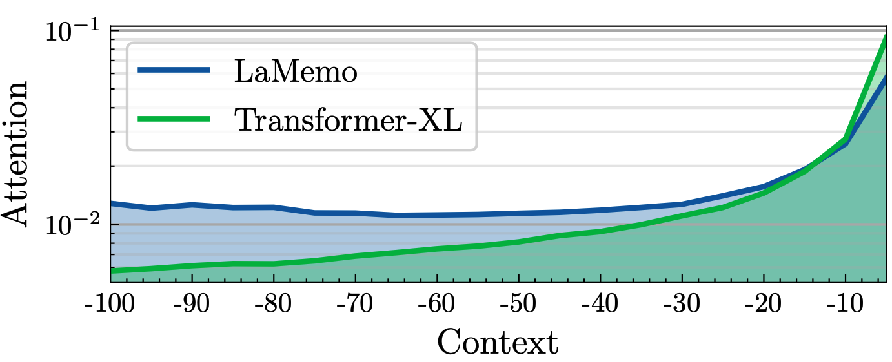

# LaMemo: Language Modeling with Look-Ahead Memory

This repository contains the pytorch implementation of our paper:

> [LaMemo: Language Modeling with Look-Ahead Memory](https://arxiv.org/pdf/2204.07341.pdf)

The look-ahead memory allows the model to update the memory represetations with the context on its right and interpolate with the old memory for bi-directionality. As shown in the figure below, this mechanism increases model's utilization of distant contexts compared to the recurrence memory in Transformer-XL.

<div align="center">
  
</div>

## Requirements

You need PyTorch 1.10.0 or above to run the code. You also need [Apex](https://github.com/NVIDIA/apex) for mixed-precision training. The script uses distributed data parallel on multiple GPUs with mixed-precision at `O2` level for better efficiency.

## Prepare Data

First download the data by running `getdata.sh`. All the data should be processed in the `data` folder. For text8, run `prep_text8.py` for preprocessing.

## Training

Run the scripts in `pytorch` folder with different model configuration by specifying the `--attn_type` argument:

- `attn_type = 0`: use rpe of transformer-xl & recurrence memory
- `attn_type = 1`: use rpe of Shawn (2018) & recurrence memory
- `attn_type = 2`: use aboslute postion encodings (`mem_len` set to 0)
- `attn_type = 3`: use disentangled rpe & look-ahead memory (**default configuration of LaMemo**)
- `attn_type = 31`: use rpe of transformer-xl & look-ahead memory
- `attn_type = 32`: use disentangled rpe ver2 (learn two vectors $u_+$  and $u_-$ in eq(12)) & look-ahead memory
- `attn_type = 33`: use disentangled rpe & look-ahead memory with full look-ahead attention

To train LaMemo base on wikitext-103, run the following command in `pytorch`:
```bash
bash run_wt103_base_ddp.sh train 2 
```

For text8 and enwik8, the training command is similar.

We provide pre-trained checkpoints of [LaMemo]() base and [Transformer-XL]() base on wikitext-103.
Make a new `models` directory and move the unzipped model files into this directory.

## Evaluation

To evaluate LaMemo base on wikitext-103, run the following command in `pytorch`:
```bash
bash run_wt103_base_ddp.sh eval 1 --work_dir /path/to/model/checkpoint
```

For text8 and enwik8, the evaluation command is similar.

## Text Generation

We provide a script to generate text from models trained on wikitext-103. 
You can provide the prompt manually by setting `--manual` argument to the prompt file. 
The default decoding strategy uses top-p sampling with p=0.95 and temperature=1.0.

```bash
bash run_wt103_base_ddp.sh gen 1 --manual ../data/wt103-prompt2.txt \
```

## Acknowledgement

This repository is implemented based on the original transformer-xl [repo](https://github.com/cdjhz/transformer-xl-ddp), and the Nvidia's [implementation](https://github.com/enod/Nvidia-Transformer-XL) which supported mixed-precision training.

## Citation

```
@inproceedings{ji2022LaMemo,
    title = "LaMemo: Language Modeling with Look-Ahead Memory",
    author = "Haozhe Ji, Rongsheng Zhang, Zhenyu Yang, Zhipeng Hu, Minlie Huang",
    booktitle = "2022 Annual Conference of the North American Chapter of the Association for Computational Linguistics",
    year = "2022",
}
```

**Please kindly cite our paper if you find this paper and the codes useful!**

